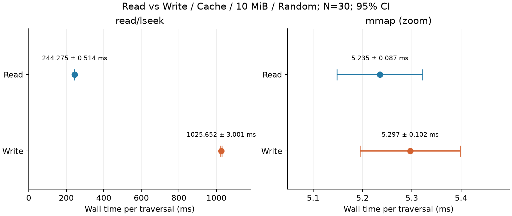
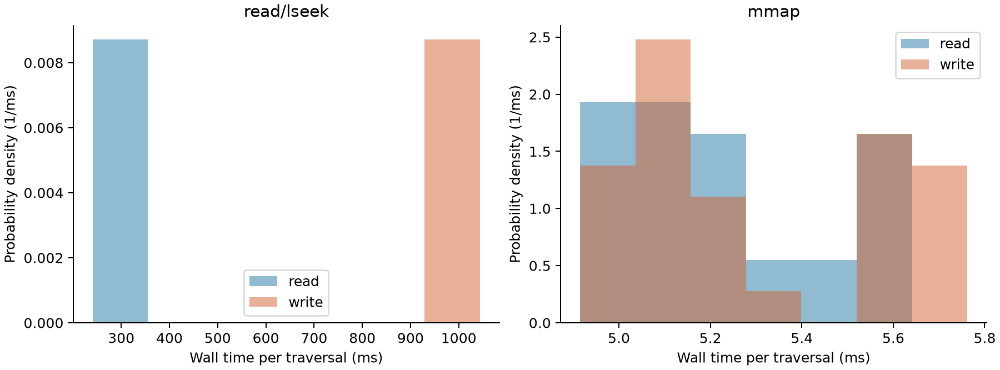
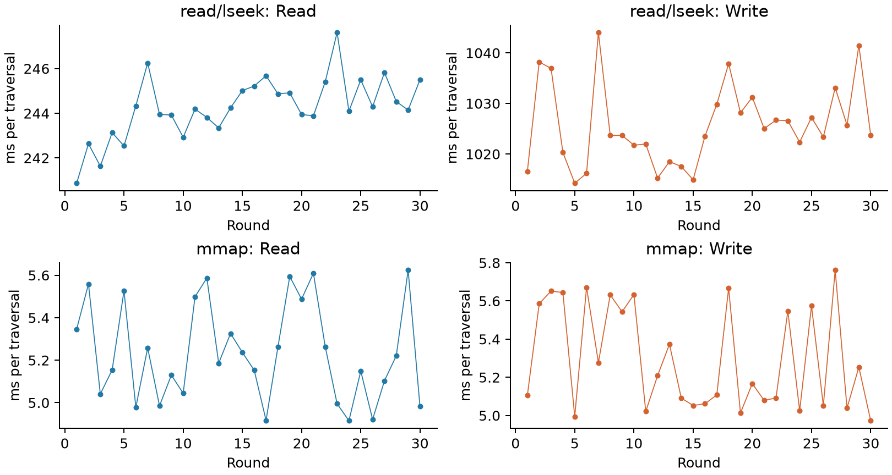

# Отчёт: Read vs Write, Cache, 10M, Rand

## 1. Постановка и гипотезы

Вариант: Read vs Write, Cache, 10M, Rand. Сравниваются чтение и обновление записей одного случайного графа через read/lseek и mmap. Write означает чтение записи и инкремент её поля value; это read-modify-write, а не изолированная запись.

Рабочие гипотезы: обновление медленнее чтения из-за дополнительных операций и загрязнения страниц; mmap быстрее read/lseek благодаря отсутствию системных вызовов на каждую вершину. В прогретом файловом кэше характеристики диска ожидаются менее существенными, чем стоимость переходов в ядро. Размер: 10485760 байт (10 МиБ), 436905 вершин по 24 байта, заголовок 40 байт, seed=427.

## 2. Паспорт и ограничения окружения

ОС: ProductName:		macOS; ProductVersion:		27.0.1; BuildVersion:		26A434. Модель Mac15,6; CPU Apple M3 Pro; 11 ядер (5 производительных, 6 энергоэффективных); RAM 18 ГиБ. Накопитель: Model: APPLE SSD AP0512Z; локальная файловая система APFS.

Страница ОС: 16384 байт. Граф сгенерирован с --page-size=16384, --topology chain, -b 0.5, --min-step-pages 2. Проверены отсутствие циклов и достижимость всех вершин. Доля межстраничных переходов: 98.84%. Принудительное расстояние не гарантирует промах CPU-кэша или файлового кэша.

Работа выполнена в macOS. Файл лежит на локальном разделе; параметры ОС зафиксированы системными утилитами. Объём 10 МиБ значительно меньше RAM, что соответствует тёплому page cache. CPU affinity не контролировалась; планировщик выбирал ядро. Частота, Turbo, температура и миграции не контролировались. Перед серией на адаптере фоновые приложения были закрыты; системные службы macOS продолжали работать. Uptime, top, vm_stat и питание записаны до и после серии; стенд не был полностью изолирован. Файловый кэш и CPU-кэш - разные уровни; прогрев первого не гарантирует постоянного состояния второго.

Снимок перед финальной серией: 10:12  up 19:08, 2 users, load averages: 2.73 2.90 2.75; CPU usage: 0.81% user, 8.13% sys, 91.5% idle . После: 10:15  up 19:11, 2 users, load averages: 1.87 2.39 2.56; CPU usage: 3.14% user, 16.53% sys, 80.31% idle . Питание перед серией: Now drawing from 'AC Power';  -InternalBattery-0 (id=35979363)	76%; charging; 0:51 remaining present: true. Питание после серии: Now drawing from 'AC Power';  -InternalBattery-0 (id=35979363)	79%; charging; 0:57 remaining present: true. Источник питания подтверждён двумя снимками; остаточная фоновая загрузка ограничивает переносимость результатов. Частота во время финальной серии и размеры CPU-кэшей не определены.

Компиляция обоих прототипов: clang -O2 -Wall -Wextra, без изменения исходников. Полная версия компилятора сохранена в паспорте. Сборка выполнена без предупреждений.

## 3. Методика и выбор числа запусков

Основная метрика: время всего дочернего процесса, измеренное perf_counter_ns и делённое на 5 обходов. В неё входят запуск, открытие/отображение и закрытие файла, диагностический вывод в pipe. Это оценка средней стоимости одного обхода при данном протоколе, а не чистого тела цикла. User/sys и rusage измеряются для завершённого дочернего процесса. Нормированные пять обходов одного процесса считаются одним наблюдением.

Кэш включён: --no-cache не передаётся. Два прогревочных запуска каждой конфигурации выполнены заранее и сохранены отдельно. Во время серии кэш не сбрасывался. Четыре конфигурации перемешиваются в каждом раунде с seed=427. Пилотные 10 запусков каждой конфигурации исключены из итоговой серии. Выбросы итоговой серии не удалялись.

Цель - полуширина 95% ДИ не более 5% среднего. По пилоту N уточнялось из N ≈ (t·s/(0.05·mean))², минимум 30, максимум 100. Пилотные оценки N: {'graph_traverse/read': 30, 'graph_traverse/write': 30, 'graph_traverse_mmap/read': 30, 'graph_traverse_mmap/write': 30}. Итог: N=30 на каждую конфигурацию. При превышении ограничения 100 целевая точность может не достигаться; это проверяется по финальным данным.

Среднее = сумма/N; выборочное стандартное отклонение s вычислено с делителем N-1. ДИ = mean ± t(0.975,N-1)·s/√N. ДИ относится к среднему, а не к разбросу отдельных запусков. Формула предполагает достаточно независимые наблюдения и устойчивое среднее; фоновые задачи и временная зависимость ограничивают её точность. Медиана и IQR сохранены в summary.csv. Непересечение ДИ используется как консервативный учебный критерий; пересечение само по себе не доказывает равенство.

## 4. Результаты и статистическая точность

read/lseek: Read: N=30; среднее 0.244275 с; s=0.001377 с; 95% ДИ [0.243761; 0.244789] с; полуширина 0.21%; медиана 0.244216 с; IQR 0.001336 с.

read/lseek: Write: N=30; среднее 1.025652 с; s=0.008036 с; 95% ДИ [1.022651; 1.028653] с; полуширина 0.29%; медиана 1.023700 с; IQR 0.008744 с.

mmap: Read: N=30; среднее 0.005235 с; s=0.000233 с; 95% ДИ [0.005148; 0.005322] с; полуширина 1.66%; медиана 0.005203 с; IQR 0.000410 с.

mmap: Write: N=30; среднее 0.005297 с; s=0.000273 с; 95% ДИ [0.005195; 0.005398] с; полуширина 1.92%; медиана 0.005188 с; IQR 0.000528 с.

| Конфигурация | N | Mean, ms | s, ms | 95% CI, ms |
|---|---:|---:|---:|---|
| read/lseek: Read | 30 | 244.275 | 1.377 | [243.761; 244.789] |
| read/lseek: Write | 30 | 1025.652 | 8.036 | [1022.651; 1028.653] |
| mmap: Read | 30 | 5.235 | 0.233 | [5.148; 5.322] |
| mmap: Write | 30 | 5.297 | 0.273 | [5.195; 5.398] |

Гистограмма показывает плотность частот в интервалах; KDE сглаживает наблюдения ядром и зависит от выбранной ширины сглаживания. Здесь использована гистограмма с общими границами корзин для Read и Write в каждой паре. Форма эмпирического распределения при данном N не доказывает нормальность.

## 5. Сравнение и объяснение

read/lseek: Write/Read = 4.199; обновление медленнее на 319.9%. 95% ДИ не пересекаются.

mmap: Write/Read = 1.012; обновление медленнее на 1.2%. 95% ДИ пересекаются. Гипотеза о замедлении при обновлении убедительно подтверждается для read/lseek; для mmap наблюдаемая разница мала относительно неопределённости. По этому учебному критерию утверждать различие mmap Read и Write нельзя.

Отношение read/lseek к mmap: 46.66 при чтении, 193.64 при обновлении. Для каждого узла read/lseek выполняет lseek и read (плюс lseek и write при обновлении). На один обход по исходному коду ожидаются 873812 таких вызовов чтения/позиционирования, а при обновлении - 1747622 вызовов read/write/lseek, без учёта open/close и сообщений. Это анализ кода, а не результат трассировки.

Среднее user/sys на процесс (5 обходов): read/lseek Read 0.2227/0.9970 с; Write 0.4631/4.6574 с; mmap Read 0.0223/0.0019 с; Write 0.0226/0.0021 с. Minor faults: 339.9, 339.8, 3540.0, 3540.0, соответственно. Полные счётчики переключений и major faults приведены в summary.csv и PDF.

mmap отображает файл целиком и затем обращается к памяти. Повторное отображение в каждом обходе требует восстановления отображений страниц даже при наличии данных в page cache; minor faults не равны чтениям с диска. Переключения контекста возникают из-за планировщика и ожиданий: системный вызов сам по себе не означает переключение процесса.

Обе Cache-конфигурации обновляют данные без fsync/msync. Завершение процесса не гарантирует запись на физический носитель. Поэтому полученные числа характеризуют буферизованный read-modify-write; из них нельзя получить скорость устойчивой записи SSD. Dirty writeback может происходить асинхронно и создавать шум в следующих запусках.

## 6. Мониторинг, фоновая нагрузка и достаточность

strace/perf относятся к Linux и здесь не запускались. dtruss не запускался: для трассировки нужны дополнительные права и доступ зависит от SIP. Полные счётчики системных вызовов и cache-misses отсутствуют; смены ядра разобраны ниже. Для характеризации использован отдельный /usr/bin/time -l; его вывод сохранён в runs.log. Не следует выдавать вычисленные по исходнику числа вызовов за результаты мониторинга.

Дополнительная проверка от 05.10.2026: питание от адаптера, lowpowermode=['0', '0']. В отдельной нагрузке graph_traverse --write 10 получено 10 образцов powermetrics с интервалом около 1 с: состояния теплового давления ['Nominal']; частота P-кластера 3773-3779 МГц. Это системные счётчики отдельного запуска; они не устанавливают частоту конкретного процесса и не доказывают отсутствие троттлинга во время основной серии. Логи: results/mac-diagnostics/.

System Trace разобран: при read/lseek Read на read и lseek приходится 99,4% веса выборок. При Write: write 51,8%, lseek 28,1%, read 19,6%. У mmap Read/Write на main приходится 99,1%/98,6%. Это веса выборок верхнего кадра пользовательского стека, а не количество вызовов или точная доля kernel time. Результаты согласуются с объяснением различий и независимыми счётчиками user/sys.

Основной поток выполнялся только на P-ядрах, со сменами ядра 19/46/8/2 в порядке таблицы. Running занимает 96,9-99,6% экспортированного окна; ожидания не доминируют. Начальный Blocked до запуска исключён; у read/lseek Read отсутствует событие завершения, поэтому возможен хвост записи. Подробности и ограничения: TRACE_ANALYSIS.md. Экспорт: results/system-trace/; скрипт: scripts/analyze_traces.py.

graph_traverse, 5 пар: обычный запуск 244.884 мс; под time 244.874 мс; отношение 1.000. 95% ДИ пересекаются. Замер включает запуск time. Сырые данные: diagnostics.csv.

graph_traverse_mmap, 5 пар: обычный запуск 5.176 мс; под time 5.322 мс; отношение 1.028. 95% ДИ пересекаются. Замер включает запуск time. Сырые данные: diagnostics.csv.

Один запуск с собственным CPU worker: 249.012 мс/обход; итоговое среднее без этой нагрузки - 244.275 мс. Работник использует один CPU, всегда останавливается после проверки. Одного наблюдения недостаточно для вывода о систематическом влиянии нагрузки.

Итоговая относительная полуширина 95% ДИ: read/lseek: Read 0.21%; read/lseek: Write 0.29%; mmap: Read 1.66%; mmap: Write 1.92%. Грубые оценки N для точности 5% при t≈1.96: 2, 2, 4, 5, соответственно. Эти оценки не заменяют t-квантиль при малом N; фактически использовано N=30. При увеличении N в 4 раза полуширина примерно вдвое меньше при неизменной дисперсии; систематические ошибки это не устраняет.

## 7. Общий вывод и воспроизведение

Гипотеза о преимуществе mmap согласуется с данными обеих нагрузок. В исследованном варианте различия следует объяснять стоимостью доступа к закэшированным данным, количеством переходов в ядро и обработкой отображений страниц. Критичны одинаковый случайный граф, прогретый кэш, одинаковая сборка и число обходов. Конкретная модель диска менее существенна для чтения в тёплом кэше, но изолированное влияние оборудования и CPU affinity в этой работе не проверялось. Выводы относятся к данному стенду и Cache-семантике.

Полный запуск: bash scripts/run.sh. Для Linux можно передать --core с доступным CPU: bash scripts/run.sh --core 2. Анализ существующих CSV: out/venv/bin/python scripts/analyze.py. Генерация и сбор: scripts/experiment.py prepare и collect. Папка results содержит паспорт, план, журнал, пилот, прогрев, четыре финальных CSV и статистику; figures - графики. Генератор расположен в ../util/graphgen.py и должен оставаться доступным.

Проверка результатов: все запуски завершились успешно; каждый обход обработал все 436905 вершин. Поле value каждой вершины увеличилось ровно на ожидаемое число Write-обходов, остальные байты структуры остались неизменными. Сырые CSV позволяют пересчитать результаты без новых измерений.

Дополнительное сравнение условий: первоначальная серия выполнена 04.10.2026 на батарее, основная серия - 05.10.2026 на адаптере. Обе серии содержат по 30 наблюдений каждой конфигурации, но выполнены в разное время и при разном фоне. Их нельзя считать контролируемым экспериментом по изолированному влиянию питания.

read/lseek: Read: батарея 257.491 мс; адаптер 244.275 мс; снижение среднего времени 5.1%. Сырые данные старой серии сохранены отдельно: results/battery-baseline/.

read/lseek: Write: батарея 1134.786 мс; адаптер 1025.652 мс; снижение среднего времени 9.6%. Сырые данные старой серии сохранены отдельно: results/battery-baseline/.

mmap: Read: батарея 5.938 мс; адаптер 5.235 мс; снижение среднего времени 11.8%. Сырые данные старой серии сохранены отдельно: results/battery-baseline/.

mmap: Write: батарея 6.030 мс; адаптер 5.297 мс; снижение среднего времени 12.2%. Сырые данные старой серии сохранены отдельно: results/battery-baseline/.

Основная статистика и графики используют только новую серию, результаты двух дней не объединялись. Общие выводы сохранились: mmap быстрее обоих режимов read/lseek; обновление read/lseek существенно медленнее чтения, а для mmap интервалы Read и Write пересекаются.
